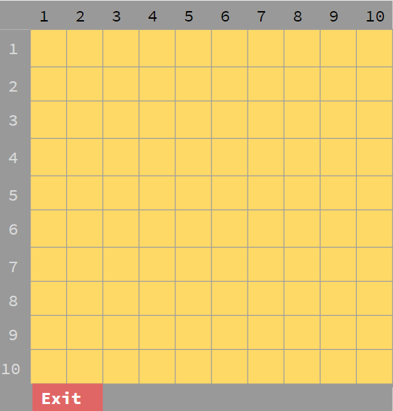
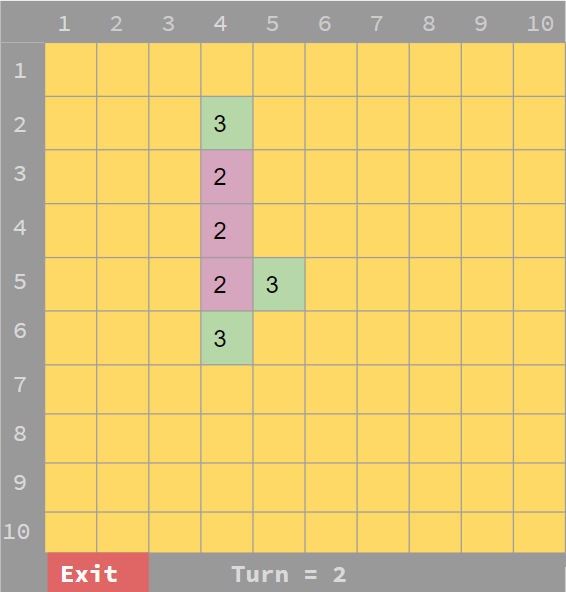
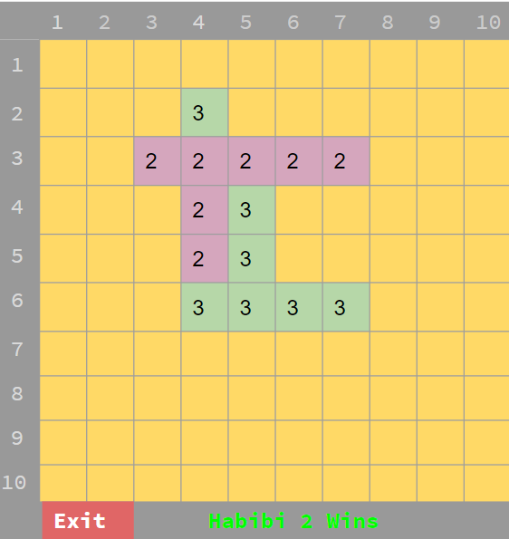

# Board_game-CS3001-

Its a simple board game and a part of my assignment.

## Habibi (حبيبي)Time pass

**Habibi (حبيبي)Time pass** is an abstract strategy board game. It is traditionally a two player game played with Habibi Digits (2 and 3) on a Habibi board. It can be played using the 20×20 Habibi board or the 10×10 Habibi board. 
The main objective of “Habibi (حبيبي)Time” pass is you must try to create a row of 5 or more digits in any direction to win. It is a straightforward yet fun game.

## Requirements

* Python 3 (any version will do)
* Tkinter

## Installing

Simply open "Habibi.py" in the "Habibi" folder through Python and run.

## Instructions

1. It is traditionally played with Habibi Digits (2 and 3) on a 20×20 or 10×10 Habibi board.

2. Players alternatively place a digit assigned to them (either 2 or 3) on an cell.

3. The winner is the first player to form an unbroken chain of five digits horizontally, vertically, or diagonally to get a sum of (10 or 15) depending upon his chosen number.

4. So both the players should try to place their number in such a manner that their opponent aren’t able to make 5 digits in a row,column or diagonally.

## Screenshots

Blank Board             |  Game In-process        |  Game Ended 
:----------------------:|:----------------------: |:----------------------:
  |           |  

# Built With

* Python 3

# Contributing

Pull requests are welcome. For major changes, please open an issue first to discuss what you would like to change.

*Please make sure to update tests as appropriate.*

# Author 

**Sheikh Muhammed Tadeeb**
